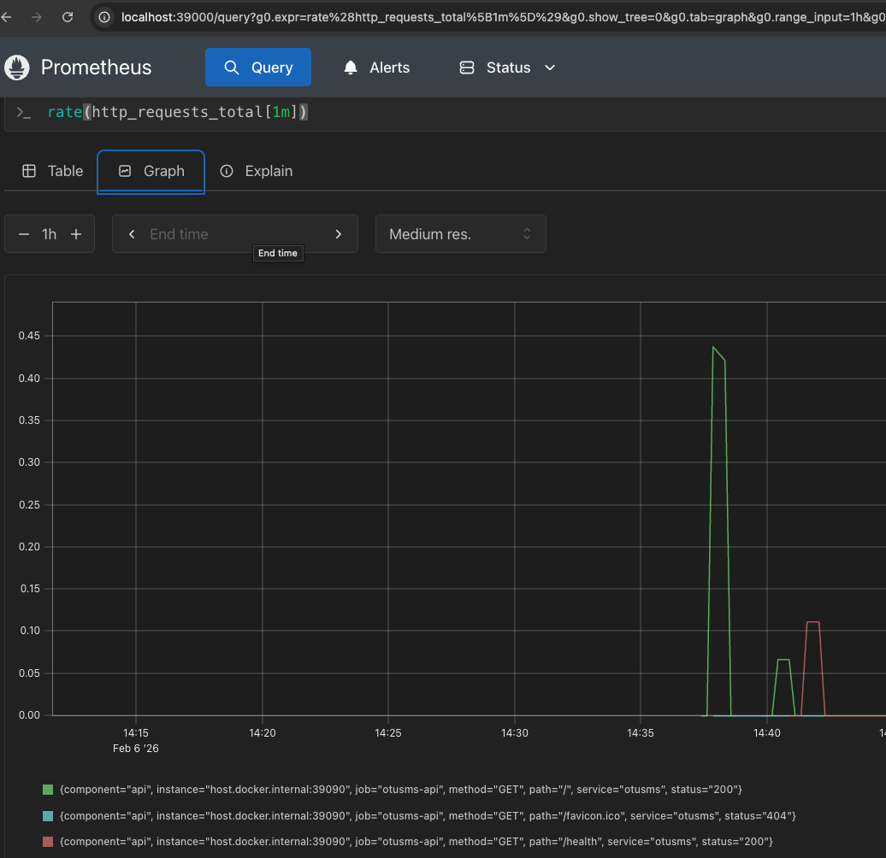
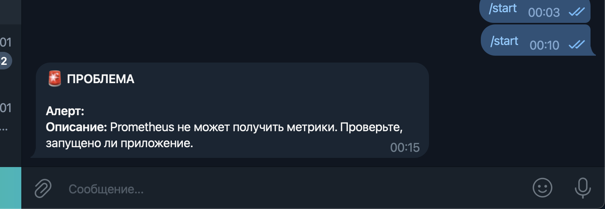

# Изменения в ветке feat/UpLoger

## Обзор

Добавлена полноценная система наблюдаемости (observability) для микросервиса: структурированное логирование, сбор метрик и алертинг.

---

## 1. Структурированное логирование

✅ **Реализовано:**
- Структурированные логи в JSON формате (готово для ELK stack)
- Цветной вывод в консоль для локальной разработки (библиотека tint)
- Автоматическое добавление `request_id` для корреляции запросов
- Логирование на всех слоях: handlers, services, repository
- Централизованная конфигурация уровня логирования

**Результат:** Логи готовы к отправке в Elasticsearch/Loki без дополнительных изменений.

---

## 2. HTTP метрики и Prometheus

✅ **Реализовано:**
- Автоматический сбор HTTP метрик на всех запросах
- Отдельный metrics сервер (порт 39090)
- 4 типа метрик: количество запросов, время ответа, размер запроса/ответа
- Prometheus сервер для сбора и хранения метрик
- Web UI для просмотра метрик и построения графиков

**Результат:** Возможность мониторить производительность и нагрузку в реальном времени.

---

## 3. Алертинг в Telegram

✅ **Реализовано:**
- Alertmanager для управления уведомлениями
- Telegram бот для получения алертов
- Правило алерта при недоступности сервиса
- Уведомления о проблеме и восстановлении

**Результат:** Моментальное уведомление в Telegram при падении сервиса.

---

## Архитектура

```
┌──────────────┐
│ Приложение   │
│              │
│ - Логи (JSON)├───────▶ Готово для ELK
│ - Метрики    ├───────▶ Prometheus ───▶ Grafana
│              │                    │
└──────────────┘                    └──▶ Alertmanager ──▶ Telegram
```

---

## Запуск мониторинга

```bash
# Запуск Prometheus + Alertmanager
docker compose -f deploy/local/docker-compose.local.yml --profile monitoring up -d

# Доступные UI:
# - Prometheus: http://localhost:39000
# - Alertmanager: http://localhost:39093
# - Метрики: http://localhost:39090/metrics
```

## Технический стек

- **Логирование:** `log/slog` + `tint` (цветной вывод)
- **Метрики:** Prometheus client library
- **Мониторинг:** Prometheus + Alertmanager
- **Уведомления:** Telegram Bot API

---

## Что дает проекту

1. **Observability** - полная видимость работы сервиса
2. **Troubleshooting** - быстрый поиск проблем через логи
3. **Мониторинг** - отслеживание производительности
4. **Алертинг** - моментальное реагирование на инциденты

---

_Все изменения протестированы._
