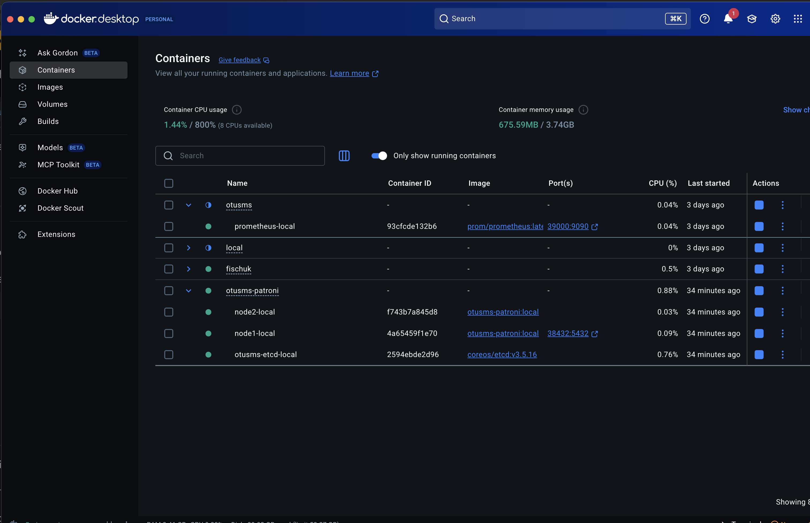

# feat/PatroniPostgres — Отказоустойчивые СУБД и шаблоны

## Что реализовано

### 1. PostgreSQL в отказоустойчивом режиме (Patroni + etcd + HAProxy)

Локальный кластер: **etcd** (DCS) + **Patroni node1** (primary) + **Patroni node2** (replica) + **HAProxy** (единая точка входа).

**Топология портов:**

| Порт    | Назначение |
|---------|------------|
| `38432` | HAProxy → PostgreSQL primary (для приложения) |
| `38480` | HAProxy stats UI |
| `38008` | Patroni REST API node1 |
| `38009` | Patroni REST API node2 |

HAProxy определяет текущий primary через `GET /primary` на Patroni REST API (порт 8008) — возвращает 200 только у primary. При failover трафик переключается автоматически без изменения конфига приложения.

**Запуск:**
```bash
docker compose -f deploy/local/docker-compose.patroni.yml up -d --build
```



---

### 2. Valkey/Redis в отказоустойчивом режиме

**Production** (`deploy/prod/docker-compose.redis.prod.yml`):
- Образ `valkey/valkey:8-alpine`, `restart: always`, persistent volume.

**Локальная разработка** (`deploy/local/docker-compose.redis.yml`):
- Порт `36379`, изолированная сеть.

Redis используется двумя сервисами на разных DB:
- **DB 0** — auth-proxy (Rate Limiter)
- **DB 1** — news-collector (состояние сбора источников)

---

### 3. etcd

Используется внутри Patroni как DCS (Distributed Configuration Store) для выборов лидера и хранения состояния кластера.

---

### 4. Шаблон: Rate Limiter

**Реализация:** `internal/ratelimiter/limiter.go`

Алгоритм: Redis INCR + EXPIRE (скользящее окно). При превышении лимита — `429 Too Many Requests`. При недоступности Redis — `fail open` (запрос пропускается, легитимные пользователи не блокируются).

**Конфигурация** (`config.auth-proxy.yaml`):
```yaml
rate_limiter:
  redis_addr: "localhost:36379"
  max_attempts: 5
  window_seconds: 60
```

**Middleware** (`internal/middleware/ratelimit.go`) подключён на роут `POST /api/v1/auth/login` в auth-proxy.

**Проверка:** 12 попыток входа с неверным паролем — первые 5 дают `401 Unauthorized`, начиная с 6-й — `429 Too Many Requests`:


---

### 5. Шаблон: Распределённый мьютекс (через Redis)

**Реализация:** `internal/store/collector/redis_state.go`

Redis Hash `nc:source:{id}` хранит операционное состояние каждого источника новостей:
- `last_collected_at` — время последнего успешного сбора
- `error_count` — счётчик ошибок (атомарный `HINCRBY`)
- `deactivated` — локальная деактивация при превышении `max_error_count`

Атомарные операции Redis (`HINCRBY`, `HSET`) исключают race condition при параллельном сборе из нескольких воркеров — это реализация паттерна распределённого мьютекса для координации планировщика.

---

## Тестирование отказов: сценарий failover PostgreSQL

Нагрузка через HAProxy (`localhost:38432`), во время которой останавливается primary:

```bash
# Терминал 1 — мониторинг IP текущего primary
while true; do
  PGPASSWORD=otus_ms psql -h 127.0.0.1 -p 38432 -U otus_ms -d otus_ms \
    -c "SELECT inet_server_addr() AS current_node;" -t 2>&1 | tr -d ' '
  sleep 0.5
done

# Терминал 2 — останавливаем primary
docker stop otusms-patroni-node1-local
```

**Результат:** IP меняется с `172.26.0.3` (node1) на `172.26.0.4` (node2) — HAProxy автоматически переключился на новый primary. Приложение продолжает работать через тот же порт `38432`.

```bash
# Убедиться, что node2 стал лидером
docker exec otusms-patroni-node2-local patronictl -c /etc/patroni/patroni.yml list
```


**Switchover обратно на node1:**
```bash
docker exec otusms-patroni-node2-local \
  patronictl -c /etc/patroni/patroni.yml switchover otusms \
  --leader node2 --candidate node1 --scheduled now --force
```

---

## Новые файлы

| Файл | Назначение |
|------|------------|
| `deploy/local/docker-compose.patroni.yml` | Compose: etcd + node1 + node2 + HAProxy |
| `deploy/local/patroni/haproxy.cfg` | Конфиг HAProxy (роутинг на primary) |
| `deploy/local/patroni/Dockerfile` | Образ Patroni + PostgreSQL 16 + entrypoint |
| `deploy/local/patroni/entrypoint.sh` | Исправление прав `0700` на PGDATA перед стартом |
| `deploy/local/patroni/patroni-node1.yml` | Конфиг primary (bootstrap existing_data) |
| `deploy/local/patroni/patroni-node2.yml` | Конфиг replica |
| `deploy/local/docker-compose.redis.yml` | Redis для локальной разработки |
| `deploy/prod/docker-compose.redis.prod.yml` | Redis для production |
| `internal/ratelimiter/limiter.go` | Rate Limiter (Redis INCR+EXPIRE) |
| `internal/middleware/ratelimit.go` | HTTP middleware для Rate Limiter |
| `internal/store/collector/redis_state.go` | Хранилище состояния сборщика в Redis |
| `internal/services/collector/service.go` | Сервис сбора новостей с координацией через Redis |
| `internal/services/collector/scheduler.go` | Планировщик (cron) сбора новостей |
