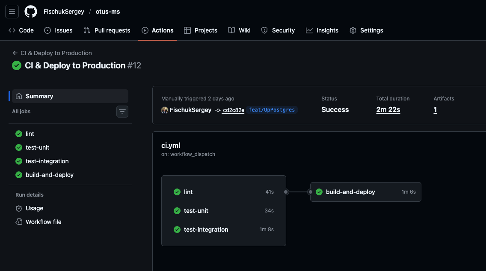
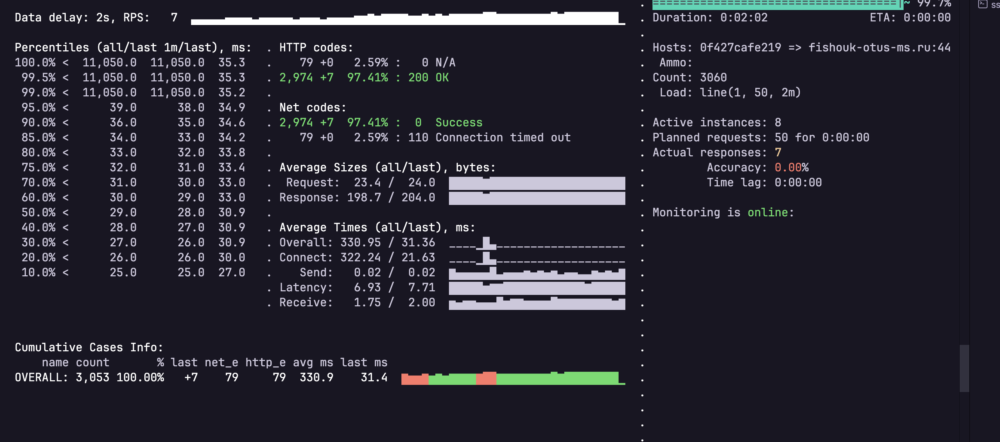

# Изменения в ветке feat/UpPostgres

## Подключение PostgreSQL

### Инфраструктура БД
- Реализована интеграция с PostgreSQL через `pgx/v5` connection pool
- Настроена автоматическая система миграций с версионированием и транзакционным применением
- Реализована таблица `schema_migrations` для отслеживания примененных миграций
- Миграции встроены в бинарник через `embed.FS` для упрощения деплоя
- Добавлена начальная миграция `001_initial_schema.sql` с таблицей `users`

### Архитектура хранилища
- Создан пакет `internal/store` с абстракцией подключения к БД
- Реализован паттерн Repository для изоляции логики работы с данными
- Настроены connection pool параметры и SSL опции
- Добавлена поддержка graceful shutdown для корректного закрытия соединений

## User API и CRUD операции

### REST API Endpoints
```
POST   /api/v1/users      - создание пользователя
GET    /api/v1/users/{uuid} - получение пользователя по UUID
DELETE /api/v1/users/{uuid} - мягкое удаление пользователя
```

### Трехслойная архитектура
1. **Handler Layer** (`internal/handlers/user`):
   - Обработка HTTP запросов/ответов
   - Валидация входных данных
   - Маршрутизация через chi router
   - Обработка ошибок с корректными HTTP статус-кодами

2. **Service Layer** (`internal/services/user`):
   - Бизнес-логика приложения
   - Валидация через `go-playground/validator/v10`
   - Преобразование DTO в модели домена
   - Централизованная обработка ошибок

3. **Repository Layer** (`internal/store/user`):
   - Работа с БД через prepared statements
   - Защита от SQL injection
   - Реализация soft delete (deleted=true, deleted_at)
   - Использование транзакций для целостности данных

### Модель данных User
```go
- uuid (UUID, PK)
- email (validated)
- first_name, last_name, middle_name
- role (default: user1C)
- created_at, updated_at
- deleted (soft delete flag)
- deleted_at, last_login
```

## GitHub Actions Workflows

### 1. Manual Database Deployment (`deploy-database.yml`)
**Триггер:** `workflow_dispatch` (ручной запуск)

**Параметры:**
- `up` - запуск PostgreSQL контейнера
- `down` - остановка БД (данные сохраняются)
- `restart` - перезапуск БД
- `logs` - просмотр логов

**Функциональность:**
- Деплой через `docker compose` на production VPS
- Использование persistent volumes для сохранения данных
- Изолированная Docker сеть `otus_network`
- SSH подключение через `appleboy/ssh-action`
- Безопасное хранение credentials через GitHub Secrets

### 2. CI/CD Pipeline Enhancement
- Интеграция тестов с временной PostgreSQL БД
- Автоматический прогон миграций при старте приложения
- Health check endpoints для мониторинга состояния БД



## Интеграционное тестирование

### Структура тестов (`tests/integration/`)
Реализованы комплексные интеграционные тесты с реальной БД:

#### Test Suite 1: User Basic Flow
1. **Create User** - создание пользователя с валидными данными
   - Проверка HTTP 201 Created
   - Валидация UUID и email формата
   
2. **Get User** - получение созданного пользователя
   - Проверка HTTP 200 OK
   - Валидация всех полей ответа
   - Проверка `deleted=false` для активного пользователя
   
3. **Delete User** - мягкое удаление
   - Проверка HTTP 204 No Content
   - Установка флага `deleted=true` и `deleted_at`
   
4. **Get Deleted User** - получение удаленного пользователя
   - Проверка HTTP 200 OK (запись доступна)
   - Валидация `deleted=true` и наличия `deleted_at`

#### Test Suite 2: User Validation
1. **Invalid UUID** - проверка обработки некорректного UUID
   - Ожидание HTTP 400 Bad Request
   
2. **Invalid Email** - проверка email валидации
   - Ожидание HTTP 400 Bad Request
   
3. **Get Non-existent User** - запрос несуществующего пользователя
   - Ожидание HTTP 404 Not Found

#### Test Suite 3: Health Check
- Проверка `/health` endpoint
- Валидация структуры ответа `{"status": "ok", "time": "..."}`
- Проверка доступности сервиса

### Настройка тестового окружения
- Использование build tag `//go:build integration`
- Docker Compose конфигурация для тестов (`docker-compose.test.yml`)
- Изолированная тестовая БД `otus_ms_test`
- Параметризация через `TEST_SERVER_URL` env variable
- HTTP клиент с таймаутами для стабильности тестов

### CI Integration
```bash
# Запуск в CI
docker compose -f deploy/test/docker-compose.test.yml up -d
go test -tags=integration ./tests/integration/...
docker compose -f deploy/test/docker-compose.test.yml down
```

## Debug Server (pprof)

### Реализация
- Создан отдельный HTTP сервер для профилирования (`cmd/main-service/debug-server.go`)
- Работает на отдельном порту (33000 в prod, 38000 в local)
- Graceful shutdown синхронизирован с основным API сервером

### pprof Endpoints
```
GET /                         - HTML интерфейс с описанием
GET /debug/pprof/             - pprof index
GET /debug/pprof/heap         - память (heap)
GET /debug/pprof/profile      - CPU профиль
GET /debug/pprof/goroutine    - список горутин
GET /debug/pprof/block        - блокировки
GET /debug/pprof/mutex        - mutex contention
GET /debug/pprof/allocs       - аллокации памяти
GET /debug/pprof/trace        - execution trace
```

### Nginx конфигурация
- Location `/debug/` проксируется на порт 33000
- Увеличенные таймауты для long-running профилирования

### Docker Compose
- Проброс портов 38080 (API) и 33000 (debug)
- Shared network `otus_network` для связи с PostgreSQL
- Volume mounts для конфигов и логов
- Health check для monitoring

## Нагрузочное тестирование

### Инструменты и настройка

**Используемый инструмент:** Yandex.Tank Установка через Docker

**Профиль нагрузки:**
- Тип: линейное нарастание (line)
- Начальная нагрузка: 1 RPS
- Конечная нагрузка: 50 RPS
- Длительность: 2 минуты
- Целевой endpoint: `/health` (production)

### Результаты тестирования



#### Статистика запросов

**Общие показатели:**
- Всего запросов: ~3,060
- Успешных ответов (200 OK): 2,912 (95.38%)
- Ошибок (Connection timeout): 141 (4.62%)
- Длительность теста: 2 минуты 8 секунд

#### Выявленные проблемы

**🔴 Критические:**
1. **Connection Timeouts (net code 110)**
   - Начинаются при нагрузке > 40 RPS
   - Указывает на исчерпание ресурсов инфраструктуры
   - Основная проблема в `connect_time`, а не в обработке запроса

**⚠️ Узкие места:**
- Nginx worker_connections (недостаточно для высокой нагрузки)
- Docker networking constraints

## Итоги

### Что добавлено
✅ PostgreSQL с миграциями и connection pooling  
✅ User CRUD API с трехслойной архитектурой  
✅ Comprehensive интеграционные тесты  
✅ Manual workflow для управления БД  
✅ Debug server с pprof для профилирования  
✅ Нагрузочное тестирование с Yandex.Tank  
✅ Анализ производительности и выявление узких мест  
