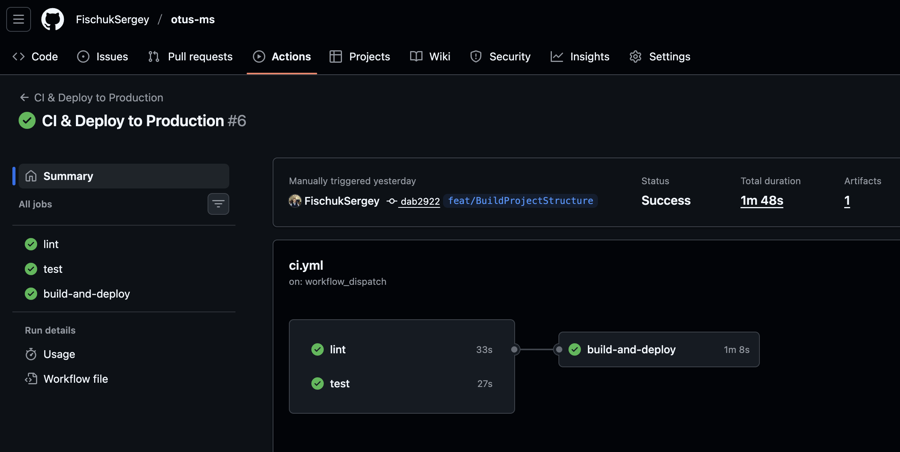
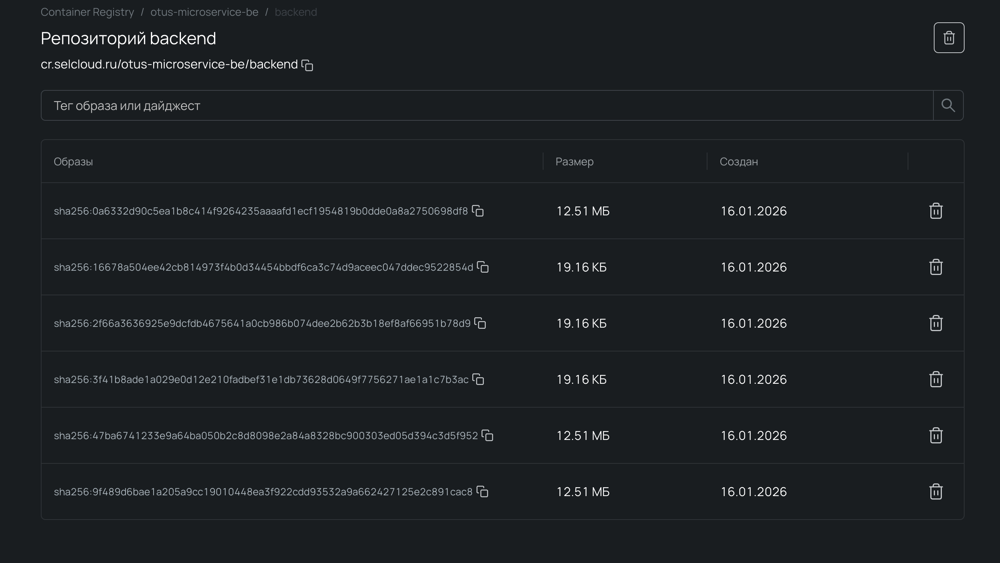

# OtusMS - Микросервисная архитектура на Go

> Production: **[https://fishouk-otus-ms.ru/](https://fishouk-otus-ms.ru/)**

Проект разработан в рамках курса OTUS "Микросервисы на GO".

## О проекте

OtusMS - это учебно-практический микросервисный проект на Go с несколькими runtime-сервисами и production-инфраструктурой.
Проект демонстрирует:

- **Сервисную декомпозицию** - API, Auth, News pipeline, Alert worker
- **Смешанные протоколы** - REST/HTTP для внешнего API и gRPC для внутреннего обмена
- **Асинхронный пайплайн** - Kafka для сбора и обработки новостей
- **Production DevOps** - отдельные docker compose окружения, CI/CD в GitHub Actions, деплой на VPS
- **Наблюдаемость** - Prometheus/Alertmanager (метрики), Loki/Promtail (логи)

**Production версия доступна по адресу:** [https://fishouk-otus-ms.ru/](https://fishouk-otus-ms.ru/)

### Текущая структура кода

```
OtusMS/
├── cmd/
│   ├── main-service/          # Основной API сервис
│   ├── auth-proxy/            # Аутентификация через Keycloak
│   ├── news-collector/        # Сбор новостей, producer в Kafka
│   ├── news-processor/        # Обработка новостей, consumer из Kafka
│   └── alert-worker/          # Обработка алертов и notifications
│
├── internal/                  # Бизнес-логика (handlers/services/store/middleware)
├── proto/                     # protobuf/gRPC контракты
├── api/                       # Swagger спецификации сервисов
├── client/                    # Streamlit UI (Python)
│
├── configs/                   # YAML конфиги сервисов + monitoring
│   └── *.example.yaml         # Шаблоны конфигурации под локал/production
│
├── deploy/                   # Инфраструктура и деплой
│   ├── local/                # Локальные compose окружения и профили
│   ├── prod/                 # Production compose + prod Taskfile
│   └── test/                 # Compose для интеграционных тестов
│
├── docs/                     # Руководства и runbook'и
├── tests/                    # Unit и integration тесты
├── .github/workflows/        # CI/CD и инфраструктурные workflow
├── *.Dockerfile              # Отдельные Dockerfile для сервисов
├── Taskfile.yml              # Локальная автоматизация
└── deploy/prod/Taskfile.yml  # Автоматизация production операций
```

## Технологический стек

### Backend / Core
- **Go 1.23.8**
- **chi/v5** - HTTP роутер
- **slog** - структурированное логирование
- **cleanenv** - парсинг конфигурации
- **validator/v10** - валидация данных
- **pgx/v5** - PostgreSQL драйвер
- **grpc + protobuf + buf** - внутренние контракты и кодогенерация
- **kafka-go** - producer/consumer для news pipeline
- **go-redis/v9** - Redis интеграция
- **aws-sdk-go-v2 (S3)** - объектное хранилище файлов
- **gocloak/v13** - Keycloak клиент для авторизации
- **golang-jwt/jwt/v5** - JWT токены и валидация
- **lestrrat-go/jwx/v2** - JWKS (публичные ключи для JWT)

### DevOps & Infrastructure
- **Docker** - контейнеризация приложения
- **Docker BuildKit** - оптимизация сборки образов
- **Docker Compose (local/prod/test)** - оркестрация сервисов
- **Selectel Container Registry** - хранение Docker образов
- **GitHub Actions** - CI/CD автоматизация
- **Nginx** - reverse proxy, SSL termination
- **Let's Encrypt** - бесплатные SSL сертификаты
- **Task** - автоматизация локальной разработки
- **PostgreSQL 16** - основная БД
- **Kafka (KRaft)** - event streaming
- **Prometheus + Alertmanager** - метрики и алерты
- **Loki + Promtail** - централизация логов

### Code Quality
- **golangci-lint** - комплексный линтер для Go
- **gofumpt** - строгое форматирование кода
- **gci** - организация импортов
- **go test** - unit тестирование

### VPS & Hosting
- **Selectel Cloud** - VPS хостинг
- **Ubuntu 22.04** - операционная система
- **UFW** - firewall

### Frontend/Admin
- **Streamlit (Python 3 + pip3)** - легковесный admin UI (`client/`)

## Примененные технические решения

Ниже краткий разбор того, как устроен проект сейчас и какие компромиссы заложены в архитектуре:

- **Много отдельных сервисов** (`main-service`, `auth-proxy`, `news-collector`, `news-processor`, `alert-worker`) дают независимый деплой, но увеличивают сложность эксплуатации.
- **REST + gRPC** позволяет разделить внешний и внутренний API, но требует аккуратно поддерживать консистентность контрактов и auth-слоев.
- **Kafka как шина событий** разгружает синхронные API пути, но в текущем single-broker режиме (replication factor = 1) не дает broker-level HA.
- **JWT/JWKS + Keycloak** централизуют IAM, но требуют операционной дисциплины по секретам и доступности IdP.
- **Наблюдаемость разделена на метрики и логи** (Prometheus/Alertmanager + Loki/Promtail), что удобно для расследований, но важно контролировать сетевую экспозицию и политику доступа.
- **CI/CD на GitHub Actions + деплой через SSH/SCP** прост для сопровождения, но сейчас использует тег `latest` и stop/start сценарий, что ухудшает rollback story и может давать краткий простой при обновлении.

## CI/CD Pipeline

### Автоматический процесс при push в `main` или вручную:

```
 GitHub Actions (ubuntu-latest)                         
                                                         
 1️⃣ Lint                                                
    ├─ Setup Go 1.23                                    
    ├─ Checkout code                                    
    └─ golangci-lint (68 linters)                       
                                                         
 2️⃣ Test                                                
    ├─ Setup Go 1.23                                    
    ├─ Checkout code                                    
    └─ go test -race -count=1 -v ./...                  
                                                         
 3️⃣ Build & Push (для нескольких сервисов)             
    ├─ Setup Docker Buildx                              
    ├─ Login to Selectel Registry                       
    └─ Build & Push images                              
       ├─ backend
       ├─ auth-proxy
       ├─ news-collector
       ├─ news-processor
       └─ alert-worker
                                                         
 4️⃣ Deploy to Production (по сервисам)                
    ├─ Copy compose files via SCP                       
    └─ Deploy via SSH                                   
       ├─ docker compose down                           
       ├─ docker compose pull                           
       ├─ docker compose up -d                          
       └─ Health check                                  

       │
       ▼

 Production Server (Selectel VPS)                       
 https://fishouk-otus-ms.ru/                            

```

### Детали CI/CD:

**Lint Stage** 
- Проверка форматирования кода
- Статический анализ (68 линтеров)

**Test Stage** 
- Unit тесты с race detector
- В дальнейшем добавим параллельное выполнение интеграционных тестов

**Build Stage**
- Multi-stage Docker build
- Оптимизация размера образа
- Push в Selectel Container Registry
- Тег: `latest` (без релизных тегов для rollback)

**Deploy Stage**
- Копирование конфигурации через SCP
- `docker compose down` -> `pull` -> `up -d`
- Pull нового образа из registry
- Автоматическая очистка старых образов

**Total pipeline time:** ~2-3 минуты от commit до production

**GitHub Secrets:** 📖 **[Документация по настройке секретов для CI/CD](.github/workflows/SECRETS.md)**



### Docker образ

**Multi-stage build для минимального размера:**
**Результат:**
- Builder stage: ~500 MB (отбрасывается)
- Final image: ~15 MB (только бинарник + Alpine)

### Selectel Container Registry

**Registry:** `cr.selcloud.ru/otus-microservice-be/backend`

Образы хранятся в приватном registry Selectel с автоматической очисткой старых версий.



**Характеристики образов:**
- Размер production образа: ~12.51 MB
- Manifest размер: ~19.16 KB
- Автоматическое версионирование по тегу `latest`
- История всех сборок доступна в registry

## 💻 Локальная разработка

### Требования

- **Go 1.23.8+**
- **Docker** (опционально)
- **Task** (опционально, для автоматизации)

### Установка Task

```bash
# macOS
brew install go-task

# Linux
sh -c "$(curl --location https://taskfile.dev/install.sh)" -- -d -b /usr/local/bin

# Windows
choco install go-task
```

### Быстрый старт

```bash
# Клонировать репозиторий
git clone https://github.com/FischukSergey/otus-ms.git
cd otus-ms

# Установить зависимости
go mod download

# Запустить полный цикл разработки (lint/test/build)
task

# Или запустить main-service напрямую
go run ./cmd/main-service -config configs/config.local.yaml
```

### Доступные Task команды

```bash
# Полный цикл (tidy, fmt, lint, test, build)
task

# Отдельные команды
task tidy           # go mod tidy
task fmt            # Форматирование кода (gofumpt + gci)
task lint           # Линтинг (golangci-lint в Docker)
task tests          # Запуск тестов
task build          # Сборка бинарника

# С Docker Compose (примеры профилей)
docker compose -f deploy/local/docker-compose.local.yml up -d
docker compose -f deploy/local/docker-compose.local.yml logs -f
docker compose -f deploy/local/docker-compose.local.yml down

# Отдельные профили
docker compose -f deploy/local/docker-compose.local.yml --profile db up -d
docker compose -f deploy/local/docker-compose.local.yml --profile auth up -d
docker compose -f deploy/local/docker-compose.local.yml --profile monitoring up -d
docker compose -f deploy/local/docker-compose.local.yml --profile news-collector up -d
docker compose -f deploy/local/docker-compose.local.yml --profile news-processor up -d
```

### Локальные профили compose

| Профиль | Что запускает | Когда использовать |
|---|---|---|
| `db` | PostgreSQL | Локальная разработка API и тесты БД |
| `auth` | Auth-Proxy | Проверка login/refresh/logout |
| `monitoring` | Prometheus + Alertmanager | Проверка метрик и алертов |
| `news-collector` | News Collector | Сбор новостей из источников |
| `news-processor` | News Processor | Обработка новостей из Kafka |

### Настройка Auth-Proxy (если нужен)

Перед запуском Auth-Proxy создайте конфиг с реальным Client Secret:

```bash
# 1. Скопируйте example файл
cp configs/config.auth-proxy.local.example.yaml configs/config.auth-proxy.local.yaml

# 2. Откройте файл и замените 'your-client-secret-here' на реальный secret из Keycloak
nano configs/config.auth-proxy.local.yaml
```

### Проверка работы

```bash
# Main Service health check
curl http://localhost:38080/health

# Auth-Proxy health check (если запущен с --profile auth)
curl http://localhost:38081/health

# Главная страница
curl http://localhost:38080/
```

## Тестирование

📖 **[Полное руководство по тестированию](TESTING.md)**

### Быстрый старт

```bash
# Unit тесты
task test:unit

# Интеграционные тесты (требуют подготовки)
cp configs/config.auth-proxy.test.example.yaml configs/config.auth-proxy.test.yaml
# Отредактируйте config.auth-proxy.test.yaml - добавьте client_secret
task test:integration

# Все тесты
task tests
```

### Что тестируется?

**Unit тесты:**
- Конфигурация и валидация
- Бизнес-логика

**Интеграционные тесты (в Docker):**
- Main Service API (users CRUD)
- Auth-Proxy (login/refresh/logout)
- PostgreSQL интеграция

### Особенности

- **Локально:** секреты в файлах (в .gitignore), никаких `export` не нужно
- **CI/CD:** секреты через GitHub Secrets → [документация](.github/workflows/SECRETS.md)
- **Auth-Proxy тесты:** требуют настройки Keycloak client и тестового пользователя

📖 Подробности: [TESTING.md](TESTING.md) | [tests/integration/README.md](tests/integration/README.md)

## Production деплой

### Production окружение

- **URL:** https://fishouk-otus-ms.ru/
- **Server:** Selectel Cloud VPS
- **OS:** Ubuntu 22.04 LTS
- **Reverse Proxy:** Nginx
- **SSL:** Let's Encrypt (автообновление)
- **Container Runtime:** Docker
- **Registry:** Selectel Container Registry

### Автоматический деплой

При push в `main` ветку автоматически:
1. Проходит все проверки (lint, test)
2. Собираются и публикуются Docker образы сервисов
3. Копируются compose-файлы на production сервер
4. Деплоятся сервисы через `docker compose`
5. Выполняется health check

### Ручные production операции

Все операции управления production окружением собраны в `deploy/prod/Taskfile.yml`.

```bash
# Пример запуска задач production из корня проекта
task -d . -t deploy/prod/Taskfile.yml status
task -d . -t deploy/prod/Taskfile.yml config:upload:all
task -d . -t deploy/prod/Taskfile.yml kafka:up
```

Основные compose-файлы production:
- `deploy/prod/docker-compose.be.prod.yml`
- `deploy/prod/docker-compose.auth-proxy.prod.yml`
- `deploy/prod/docker-compose.news-collector.prod.yml`
- `deploy/prod/docker-compose.news-processor.prod.yml`
- `deploy/prod/docker-compose.alert-worker.prod.yml`
- `deploy/prod/docker-compose.db.prod.yml`
- `deploy/prod/docker-compose.redis.prod.yml`
- `deploy/prod/docker-compose.kafka.prod.yml`
- `deploy/prod/docker-compose.loki.prod.yml`


## 🌐 Микросервисы

### Main Service (порт 38080)

Основной микросервис для работы с пользователями.

**Endpoints:**

- `GET /` - Приветственное сообщение
- `GET /health` - Health check
- `POST /api/v1/users` - Создание пользователя
- `GET /api/v1/users` - Список пользователей (admin)
- `GET /api/v1/users/{uuid}` - Получение пользователя
- `DELETE /api/v1/users/{uuid}` - Удаление пользователя
- `GET /api/v1/users/me/preferences` - Получение персональных предпочтений
- `PUT /api/v1/users/me/preferences` - Обновление персональных предпочтений
- `GET /api/v1/news/feed` - Персонализированная лента новостей
- `POST /api/v1/news/events` - Отправка user events (view/click/like/dislike/hide)

**Example:**
```bash
curl https://fishouk-otus-ms.ru/health
```

### Auth-Proxy Service (порт 38081)

Микросервис для централизованной авторизации через Keycloak.

**Endpoints:**

- `GET /health` - Health check
- `POST /api/v1/auth/login` - Логин пользователя
- `POST /api/v1/auth/refresh` - Обновление токена
- `POST /api/v1/auth/logout` - Logout пользователя

**Подробная документация:** [AUTH_PROXY_API.md](docs/AUTH_PROXY_API.md)

**Example:**
```bash
# Health check
curl http://localhost:38081/health

# Login
curl -X POST http://localhost:38081/api/v1/auth/login \
  -H "Content-Type: application/json" \
  -d '{"username":"test@example.com","password":"test123"}'
```

**Архитектура авторизации:**
- Централизованная аутентификация через Keycloak
- JWT токены для API доступа
- Refresh token для обновления
- Логирование всех попыток авторизации

См. полную документацию: [Feat_Authorization.md](Feat_Authorization.md)

### Streamlit Admin (client/)

Веб-клиент на Python/Streamlit для входа, дашборда сервисов и работы с пользователями.

```bash
cd client && python3 -m venv .venv && source .venv/bin/activate && pip3 install -r requirements.txt && streamlit run app.py
```

Подробнее: [client/README.md](client/README.md)

### 🔐 RBAC (Role-Based Access Control)

Контроль доступа на основе ролей из JWT токенов Keycloak.

**Доступные роли:**
- `user` - обычный пользователь с базовыми правами
- `admin` - администратор с полным доступом

**Защищённые endpoints (Main Service):**
```
POST   /api/v1/users                  → service-account, admin
GET    /api/v1/users                  → admin
GET    /api/v1/users/{id}             → admin
DELETE /api/v1/users/{id}             → admin
GET    /api/v1/news                   → admin
GET    /api/v1/users/me/preferences   → user, admin
PUT    /api/v1/users/me/preferences   → user, admin
GET    /api/v1/news/feed              → user, admin
POST   /api/v1/news/events            → user, admin
```

**Middleware цепочка:**
```
Request → ValidateJWT → RequireRole → Handler
          ↓              ↓             ↓
          401           403           200
```

📖 [Полное руководство по RBAC](docs/RBAC_GUIDE.md) | [Настройка ролей](deploy/prod/KEYCLOAK_AUTH_PROXY_SETUP.md)

## ⚙️ Конфигурация

Конфигурация загружается из YAML файлов с валидацией через `validator/v10`.

### Файлы конфигурации

- `configs/config.local.yaml` - для локальной разработки (не в git)
- `configs/config.prod.yaml` - для production (не в git)
- `configs/*.example.yaml` - примеры конфигураций

### Пример конфигурации

```yaml
global:
  env: prod  # local, dev, prod

log:
  level: info  # debug, info, warn, error

servers:
  debug:
    addr: 0.0.0.0:33000  # pprof/debug endpoints
  client:
    addr: 0.0.0.0:38080  # main API
    allow_origins:
      - "https://fishouk-otus-ms.ru"
```


## 📋 Планируемые доработки news-processor

| # | Задача | Описание |
|---|--------|----------|
| 1 | **Теги** | Реализовать `ExtractTags` в `pipeline.go` — возвращать слова из `categoryKeywords`, совпавшие с текстом новости (до 10 штук) |
| 2 | **Словари категорий в БД** | Перенести `categoryKeywords` из кода в `main-service` (таблица `category_keywords`), загружать через gRPC при старте `news-processor` и обновлять по расписанию. TODO уже есть в `pipeline.go` |
| 3 | **Сброс оффсетов** | Добавить локальную задачу `kafka:consumer:reset` в `Taskfile.yml` для сброса оффсетов consumer group при разработке |
| 4 | **Длинные URL** | Пропускать новости с `url > 1000` символов с предупреждением в лог вместо падения INSERT |
| 5 | **Тесты** | Написать unit-тесты для `pipeline.go`: `StripHTML`, `ExtractSummary`, `DetectCategory`, `truncate` |
| 6 | **Retention policy** | Настроить автоудаление новостей старше N дней: `pg_cron` на уровне БД или cron-задача в `main-service`. Добавить параметр `news_retention_days` в конфиг |

## 🔗 Ссылки

- **Production:** https://fishouk-otus-ms.ru/
- **Repository:** https://github.com/FischukSergey/otus-ms
- **CI/CD:** https://github.com/FischukSergey/otus-ms/actions

## 👨‍💻 Автор

Проект разработан в рамках курса OTUS "Микросервисы на GO"

## 📄 Лицензия

MIT License - см. [LICENSE](LICENSE)

---
